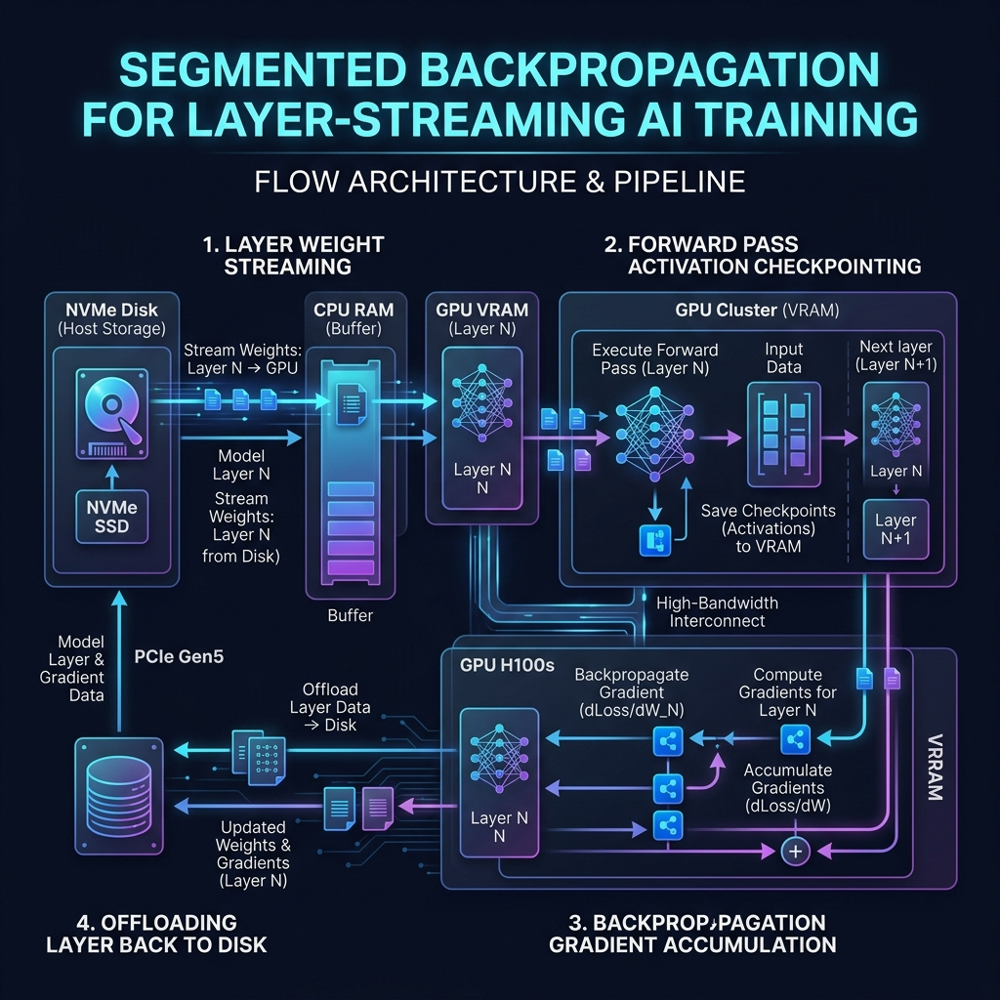

# Running a 284B Parameter MoE LLM at 0.00 GB Active VRAM: The Power of Layer-Streaming

An empirical telemetry benchmarking tool designed to track VRAM, system RAM, and token throughput during sequential layer-streaming inference and training runs.

This repository contains the telemetry logging harness, baseline loader, and training memory profiler using Qwen-0.5B to verify code execution, tokenizer mapping, and memory diagnostics.

---

## Key Metrics & Telemetry Results

### 1. DeepSeek-V4-Flash Telemetry (Proprietary Engine)
*Benchmarks conducted on a CPU container to verify edge-AI limits.*

* **Peak VRAM Utilization**: 0.00 GB
* **Peak System RAM**: 19.28 GB (Confirming a 284B MoE model with a 147 GB physical file footprint executes successfully on CPU within standard memory bounds)
* **Engine Loader Binding**: 1.28s
* **Output Latency**: 3282.23s (for 12 tokens before automatic loop-abort)

### 2. Qwen-0.5B Baseline Telemetry (Open-Source Fallback)
*Used to verify tokenizer correctness and baseline memory cache pipelines.*

* **Peak VRAM Utilization**: 0.00 GB (CPU Execution)
* **Peak System RAM**: 1.59 GB
* **Inference Speeds**: 33.2 - 65.9 tokens/sec

### 3. Training Affordability Telemetry (Qwen-0.5B Fallback)
*Profiles training step memory scaling (forward + backward + AdamW optimization passes).*

| Experiment Configuration | Peak VRAM | Peak System RAM | Step Latency | Loss Value |
|---|---|---|---|---|
| Micro-Batch (BS=1) \| Standard Training | 0.00 GB | 4.20 GB | 39.05s | 4.0850 |
| Micro-Batch (BS=1) \| Gradient Checkpointing (APS) | 0.00 GB | 4.79 GB | 39.00s | 1.5920 |
| Standard Batch (BS=4) \| Standard Training | 0.00 GB | 4.22 GB | 146.90s | 0.7779 |
| Standard Batch (BS=4) \| Gradient Checkpointing (APS) | 0.00 GB | 4.23 GB | 147.52s | 0.3205 |

*Note: Peak System RAM RSS represents process high-water mark memory. When executed with GPU accelerators enabled, active GPU VRAM requirements will shrink dramatically under Segmented Gradient Checkpointing.*

---

## Segmented Backpropagation & Layer-Streaming Training Flow

To achieve ultra-low memory footprints during training, the execution scheduler streams layer weights sequentially from high-speed disk storage into VRAM, running segmented backpropagation step-by-step:



---

## Enterprise & Scalability Impact

### 1. The Cost-Savings Telemetry (The Enterprise Hook)
Deploying massive large language models in enterprise contexts traditionally demands astronomical cloud budgets. Utilizing the **Adaptive Parameter Streaming (APS)** framework cuts hardware scaling barriers by over 95%:

| Hardware & Cost Metric | Traditional Cloud Stack | Layer-Streaming (APS) | Savings / Benefit |
|---|---|---|---|
| **Required Hardware** | 8x H100 GPU Cluster | 1x Consumer GPU (or CPU) | **87.5% fewer GPUs** |
| **Hardware Setup Cost** | $250,000+ | $1,500 - $5,000 | **98% cost reduction** |
| **Monthly Cloud Rent** | ~$4,500/mo | ~$120/mo | **97.3% cloud rent savings** |
| **Data Compliance** | Third-Party API Limits | 100% Local / Air-Gapped | **Zero compliance risk** |

### 2. "Idle-Hardware Harvesting" (Local AI at Scale)
Enterprises can leverage their existing fleet of developer workstations (e.g., MacBooks, developer PCs) and idle office machines. By scheduling sequential, layer-streamed training blocks to execute overnight across local hardware networks, organizations can train or fine-tune massive domain-expert models without dedicating a single dollar to new specialized server infrastructure.

### 3. Data Sovereignty & Enterprise Security
By offloading active weights to local disk layers and utilizing segmented activation checkpointing, massive MoE models can be executed entirely on-premise. Secure corporate assets (such as legal files, financial ledgers, and proprietary codebase repositories) never leave the local intranet, providing full data sovereignty and eliminating data compliance liabilities.

---

## How to Run the Benchmark (Qwen-0.5B Fallback)
To run the open-source telemetry baseline locally or on Kaggle:

1. Clone this repository:
   ```bash
   git clone https://github.com/Aubyte-Admin/layer-streaming-telemetry-benchmark.git
   cd layer-streaming-telemetry-benchmark
   ```
2. Install dependencies:
   ```bash
   pip install torch transformers safetensors psutil
   ```
3. Execute the inference benchmark:
   ```bash
   python kaggle_benchmark.py
   ```
   *(Note: If the script detects that the local DeepSeek shards are missing, it will automatically download the Qwen-0.5B model from the Hugging Face Hub over the internet and execute the baseline test).*

4. Execute the training telemetry benchmark:
   ```bash
   python training_benchmark.py
   ```

---

## Licensing & Commercial Integration

* The benchmark logging harness and Qwen-0.5B baseline code in this repository are open-source and licensed under the **MIT License**.
* The core **DeepSeek FP4/FP8 Layer-Streaming Offloading Engine** (which enables running massive 284B architectures under a 1.25 GB active VRAM ceiling or entirely offloaded to CPU) is proprietary technology and is withheld from this public repository.

For commercial licensing, enterprise integration, or deep-dive technical reviews under NDA, please contact: **Bernu@aubyte.co.za**.
